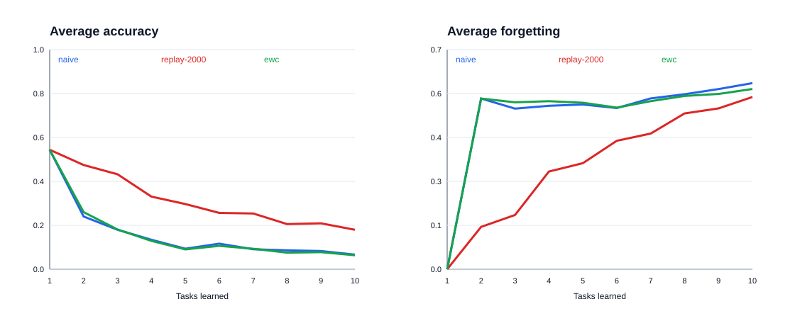
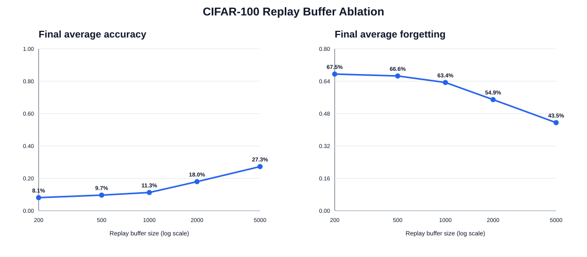
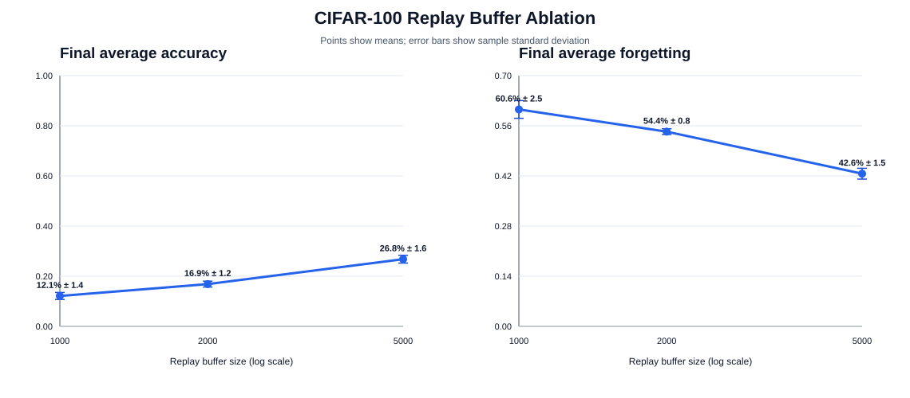

# Preliminary CIFAR-100 Results

实验日期：2026-08-20 至 2026-08-23

## 结论摘要

在当前单头 class-incremental 设置下，Experience Replay 明显优于 Naive Fine-Tuning 和 EWC。对关键容量进行三随机种子复核后，buffer 为 1,000、2,000、5,000 时的最终平均准确率分别为 **12.14% ± 1.40%**、**16.85% ± 1.18%**、**26.79% ± 1.56%**；三个 seed 都保持相同的递增顺序。EWC-10 在 seed 42 下的最终平均准确率为 6.37%，没有显示出有效改善。

| 方法 | 最终平均准确率 | 最终平均遗忘 | 训练耗时 |
|---|---:|---:|---:|
| Naive Fine-Tuning | 6.64% | 59.32% | 11.3 min |
| Replay, buffer=2,000 | **17.96%** | **54.90%** | 14.0 min |
| Online EWC, lambda=10, decay=0.9 | 6.37% | 57.46% | 12.1 min |



## 实验设置

- 数据集：CIFAR-100，50,000 张训练图和 10,000 张测试图。
- 场景：100 个类别随机排列后分为 10 个任务，每任务 10 个新类别。
- 模型：适配 32×32 图像的 ResNet-18，始终使用一个 100 类输出头。
- 训练：每任务 10 epochs，SGD，learning rate 0.1，momentum 0.9，weight decay 5e-4，batch size 128。
- 公平性：三种方法都使用 seed 42、相同类别顺序和确定性 CUDA 算法。
- Replay：reservoir sampling，buffer 2,000，replay batch 64。
- EWC：online diagonal Fisher，lambda 10，decay 0.9，每任务使用最多 1,024 个样本估计 Fisher。

完整配置、逐任务 accuracy matrix 和每个 epoch 的训练日志保存在各自的 `results.json` 中。

## 观察与解释

### 1. Naive 展现了完全灾难性遗忘

Task 1 刚学完时准确率为 54.4%，学习 Task 2 后立即降为 0%。后续也重复相同模式：模型能学会当前任务，但此前任务几乎全部归零。最终仅 Task 10 保留 66.4%，所以十任务平均只有 6.64%。

### 2. Replay 显著缓解、但没有消除遗忘

学习 Task 2 后，Replay 在 Task 1 上仍保留 40.9%，同时 Task 2 达到 54.0%。最终十任务准确率依次为：

```text
10.0, 8.0, 6.3, 4.7, 4.9, 12.8, 19.7, 11.9, 25.9, 75.4 (%)
```

Replay 的最终平均准确率约为 Naive 的 2.7 倍，但较早任务依然明显下降。一个自然的下一问题是：增加 buffer 是否持续有效，还是很快出现边际收益递减？

### 3. Buffer size 消融

保持 seed 42、模型、类别顺序、优化器、训练轮数、batch size 和 replay batch size 全部不变，只改变 buffer 容量：

| Buffer size | 最终平均准确率 | 最终平均遗忘 | 当前实现的 float32 像素载荷 |
|---:|---:|---:|---:|
| 200 | 8.11% | 67.52% | 2.34 MiB |
| 500 | 9.65% | 66.59% | 5.86 MiB |
| 1,000 | 11.28% | 63.37% | 11.72 MiB |
| 2,000 | 17.96% | 54.90% | 23.44 MiB |
| 5,000 | **27.26%** | **43.52%** | 58.59 MiB |



在这个 seed 下，容量增加带来单调改善，而且直到 5,000 都没有出现明显饱和。`1,000 → 2,000` 的准确率提高 6.68 个百分点，`2,000 → 5,000` 又提高 9.30 个百分点。5000 buffer 最终十任务准确率为：

```text
17.6, 24.3, 18.8, 18.6, 11.0, 24.4, 25.9, 25.7, 31.5, 74.8 (%)
```

当前 ReplayBuffer 保存 float32 张量，因此表中的内存是连续像素数据的理论载荷，不包含 Python list、独立 Tensor 对象和标签开销。如果改为紧凑 uint8 原图存储，同样图像的像素载荷约为四分之一，并且可以在每次 replay 时重新随机增强。

### 4. 三随机种子复核

为判断容量趋势是否只是 seed 42 的偶然结果，对关键容量 1,000、2,000、5,000 使用 seeds `0 / 1 / 42` 重复实验；其余配置保持一致。表中误差为三个运行的样本标准差：

| Buffer size | 最终平均准确率（mean ± std） | 最终平均遗忘（mean ± std） |
|---:|---:|---:|
| 1,000 | 12.14% ± 1.40% | 60.56% ± 2.47% |
| 2,000 | 16.85% ± 1.18% | 54.36% ± 0.81% |
| 5,000 | **26.79% ± 1.56%** | **42.63% ± 1.51%** |



三个 seed 的准确率分别为 `11.39 / 15.62 / 25.05%`、`13.75 / 16.98 / 28.07%`、`11.28 / 17.96 / 27.26%`，均呈现 `1,000 < 2,000 < 5,000`。因此，“增大 replay buffer 能显著改善当前配置”已经获得跨 seed 支持；但只有三次重复，仍不宜把小幅差异解释为精确的总体效应。

### 5. EWC 在这个设置中没有奏效

EWC-10 数值稳定，但最终表现和 Naive 接近。一个合理解释是：EWC 约束参数移动，却没有直接校正单头分类器对最新类别的输出偏置。这里应把结论表述为“当前设置下未观察到改善”，而不是宣称 EWC 普遍无效。

调试时还测试过 `lambda=1000, decay=1.0`，它在 Task 5 出现 loss 爆炸并产生 NaN，因此该运行被判定为无效。代码现已在 loss 首次变为非有限值时立即报错，防止无效实验静默跑完。

## 当前结论的边界

这些是可信的第一轮结果，但还不是可以投稿的最终统计结论：

- 方法间的 Naive / Replay / EWC 对比仍只有 seed 42；目前不能对三种方法的差异做完整的方差或显著性判断。
- 关键 buffer 容量已有三个 seed，但样本量仍小；200 和 500 的容量仍只有 seed 42。
- Replay buffer 保存的是加入 buffer 当时已经增强过的张量，重复采样时不会重新做随机增强；后续可比较“存原图并动态增强”。
- 当前没有学习率调度，也没有单独验证集；三种方法的超参数尚未系统调优。
- EWC 的 Fisher 使用 batch-gradient diagonal approximation，后续可与更精确的 per-sample Fisher 对比。

## 下一轮实验

优先级从高到低：

1. 把 buffer 改为紧凑 uint8 原图存储，并在 replay 时动态增强，比较准确率、显存/内存和训练时间。
2. 加入 LwF 或 DER++，观察蒸馏/日志回放能否优于纯样本 Replay。
3. EWC 小范围搜索 `lambda = 0.1 / 1 / 10 / 100` 与更低学习率。
4. 为方法间对比补足多 seed，并进行配对统计分析。
5. 把结论整理成 2–4 页短报告。
