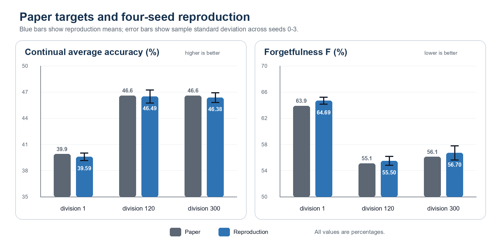
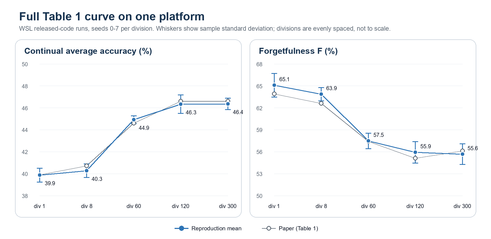

# Preliminary CIFAR-100 Results

实验日期：2026-08-20 至 2026-08-23

## 结论摘要

在当前单头 class-incremental 设置下，Experience Replay 明显优于 Naive Fine-Tuning 和 EWC。对关键容量进行三随机种子复核后，buffer 为 1,000、2,000、5,000 时的最终平均准确率分别为 **12.14% ± 1.40%**、**16.85% ± 1.18%**、**26.79% ± 1.56%**；三个 seed 都保持相同的递增顺序。EWC-10 在 seed 42 下的最终平均准确率为 6.37%，没有显示出有效改善。

| 方法 | 最终平均准确率 | 最终平均遗忘 | 训练耗时 |
|---|---:|---:|---:|
| Naive Fine-Tuning | 6.64% | 59.32% | 11.3 min |
| Replay, buffer=2,000 | **17.96%** | **54.90%** | 14.0 min |
| Online EWC, lambda=10, decay=0.9 | 6.37% | 57.46% | 12.1 min |


## Tee and Zhang (2023) 四随机种子复现

按照作者发布代码中的 interleave-division 顺序，完成了 ciFAIR-100
divisions `1 / 120 / 300` × seeds `0 / 1 / 2 / 3` 的 12 组正式实验。表中误差为四个
seed 的样本标准差，`F` 越低越好：

| Division | 复现 Avg Acc | 论文 Avg Acc | 差值 | 复现 F | 论文 F | 差值 |
|---:|---:|---:|---:|---:|---:|---:|
| 1 | 39.59% ± 0.42% | 39.9% | -0.31 pp | 64.69% ± 0.52% | 63.9% | +0.79 pp |
| 120 | **46.49% ± 0.75%** | 46.6% | -0.11 pp | **55.50% ± 0.67%** | 55.1% | +0.40 pp |
| 300 | 46.38% ± 0.55% | 46.6% | -0.22 pp | 56.70% ± 1.07% | 56.1% | +0.60 pp |



三组 Avg Acc 与论文相差 0.11–0.31 个百分点，`F` 相差 0.40–0.79 个百分点；
不仅数值接近，而且复现了主趋势：division 120 相比 division 1 显著改善，division
300 没有继续提高准确率，并且遗忘略高于 division 120。12 个 accuracy matrix 均为
20×20，没有 NaN 或 Infinity，最终矩阵进程退出码为 0，错误日志为空。

这批结果支持“成功复现所选 Table 1 条件及其相对排序”，但仍有三个边界：

- 这 12 组只覆盖 `1 / 120 / 300`；`8 / 60` 已在下文的 WSL 完整曲线中补齐；
- 论文附录写 72×72，而发布代码实际使用 74×74，本次遵循发布代码；
- 发布代码在 division 120/300 下分别每 epoch 重复 90/150 个 current examples。
  这一混淆已由下面的 equal-budget 对照实验排除。

完整方法、逐 seed 附录和复现命令见
[复现报告源文档](report/TEE_ZHANG_2023_REPRODUCTION_REPORT.md) 与
[协议审计](docs/TEE_ZHANG_2023_REPRODUCTION.md)。

## Equal-budget 对照实验（2026-09-27 至 09-28）

目的：检验 division 120/300 的提升是否来自发布代码多呈现的 90/150 个 current
examples，而不是 interleaving 本身。`equal-budget` 模式让每个 current 和 replay
样本每个 epoch 恰好出现一次；division 1 在两种模式下的训练序列完全相同，因此不需要重跑。

平台控制：同一 seed 在 Windows 与 WSL 上的结果并不逐位一致（CPU bicubic resize
的浮点舍入不同），division 120 seed 0 的 Avg Acc 相差 1.64 个百分点，超过四 seed
标准差。因此两组都在 WSL 上重新运行，按 seed 配对，并扩展到 seeds `0–7`
（32 组实验，全部 20×20 矩阵、无 NaN/Infinity、错误日志为空）。

| Division | released-code Avg Acc | equal-budget Avg Acc | 配对差值 (95% CI) | released-code F | equal-budget F | 配对差值 (95% CI) |
|---:|---:|---:|---:|---:|---:|---:|
| 120 | 46.33% ± 0.84% | 46.23% ± 0.42% | −0.10 pp [−0.59, +0.39] | 55.90% ± 1.48% | 55.92% ± 1.47% | +0.01 pp [−1.59, +1.62] |
| 300 | 46.35% ± 0.52% | 46.25% ± 0.60% | −0.10 pp [−0.40, +0.20] | 55.65% ± 1.40% | 55.82% ± 0.88% | +0.17 pp [−1.10, +1.44] |


结论：

- 重复样本没有可检测的效应。两个 division 的 Avg Acc 配对差值都是 −0.10 个百分点，
  95% CI 把效应限制在约 ±0.5 个百分点以内；精确符号翻转检验 p = 0.66 / 0.45。
- 移除重复样本后，interleaving 的收益依然存在：与同平台、同 seed 的 division 1 配对，
  equal-budget division 120/300 的 Avg Acc 高 6.36 / 6.39 个百分点，`F` 低 9.15 / 9.25
  个百分点（8/8 seed 同向，符号翻转检验 p = 0.008）。
- division 300 相比 120 依然没有额外收益（46.25% 对 46.23%），与论文的平台期一致。
- n = 4 时 division 300 曾出现 −0.39 pp 的差值（4/4 为负），扩展到 8 个 seed 后消失，
  说明这一协议下小于约 1 个百分点的单次差异不应解读。

因此，论文所说的 interleaving 收益可以归因于 interleaving 本身，而不是发布代码的样本数量差异。

## 完整 Table 1 曲线（WSL，2026-09-28 至 09-29）

在同一平台（WSL）上用 released-code 补齐 divisions `8 / 60`，并重跑 division 1，
五个 division 各 8 个 seed（共 40 组，全部 20×20 矩阵、无 NaN/Infinity、错误日志为空）。

| Division | 复现 Avg Acc | 论文 Avg Acc | 差值 | 复现 F | 论文 F | 差值 |
|---:|---:|---:|---:|---:|---:|---:|
| 1 | 39.86% ± 0.63% | 39.9% | −0.04 pp | 65.07% ± 1.61% | 63.9% | +1.17 pp |
| 8 | 40.26% ± 0.62% | 40.7% | −0.44 pp | 63.85% ± 0.91% | 62.6% | +1.25 pp |
| 60 | 44.90% ± 0.37% | 44.6% | +0.30 pp | 57.47% ± 1.05% | 57.4% | +0.07 pp |
| 120 | 46.33% ± 0.84% | 46.6% | −0.27 pp | 55.90% ± 1.48% | 55.1% | +0.80 pp |
| 300 | 46.35% ± 0.52% | 46.6% | −0.25 pp | 55.65% ± 1.40% | 56.1% | −0.45 pp |



相邻 division 的配对差值（n = 8，95% CI）：

| 比较 | Avg Acc 差值 | F 差值 |
|---|---:|---:|
| 8 − 1 | +0.40 pp [+0.08, +0.71]，p = 0.023 | −1.22 pp [−2.66, +0.22]，p = 0.094 |
| 60 − 8 | +4.65 pp [+4.24, +5.05]，p = 0.008 | −6.38 pp [−7.49, −5.26]，p = 0.008 |
| 120 − 60 | +1.42 pp [+0.93, +1.91]，p = 0.008 | −1.57 pp [−2.50, −0.65]，p = 0.008 |
| 300 − 120 | +0.02 pp [−0.52, +0.57]，p = 0.930 | −0.25 pp [−1.48, +0.97]，p = 0.750 |

结论：

- 五个 division 的 Avg Acc 与论文相差都在 0.44 个百分点以内，完整复现了 Table 1 的曲线：
  division 1→8 只有很小的提升，8→60 是主要跃升，60→120 继续显著提高，120→300 进入平台。
- division 8 相对 1 的提升（+0.40 pp）在统计上可检测，但只有论文 +0.8 pp 的一半；用四个 seed
  时 CI 跨过 0（+0.41 pp [−0.39, +1.21]），需要八个 seed 才能分辨。
- `F` 在 division 1/8/120 上比论文高 0.8–1.3 个百分点，与 Windows 复现的方向一致，是一个
  小而稳定的系统性偏移；Avg Acc 没有对应的偏移。
- WSL 的 division 1（39.86%）与 Windows 四 seed 均值（39.59%）相差 0.27 个百分点，在 seed 噪声范围内。

数据：`runs/tee-zhang-2023/wsl-platform-check/released-code/`、`runs/tee-zhang-2023/wsl-curve/`；
分析脚本 `tools/analyze_tee_zhang_curve.py`。
数据：`runs/tee-zhang-2023/equal-budget/`、`runs/tee-zhang-2023/wsl-platform-check/released-code/`、
`runs/tee-zhang-2023/equal-budget-comparison/`；分析脚本 `tools/analyze_tee_zhang_equal_budget.py`。

## 实验设置

- 数据集：CIFAR-100，50,000 张训练图和 10,000 张测试图。
- 场景：100 个类别随机排列后分为 10 个任务，每任务 10 个新类别。
- 模型：适配 32×32 图像的 ResNet-18，始终使用一个 100 类输出头。
- 训练：每任务 10 epochs，SGD，learning rate 0.1，momentum 0.9，weight decay 5e-4，batch size 128。
- 公平性：三种方法都使用 seed 42、相同类别顺序和确定性 CUDA 算法。
- Replay：reservoir sampling，buffer 2,000，replay batch 64。
- EWC：online diagonal Fisher，lambda 10，decay 0.9，每任务使用最多 1,024 个样本估计 Fisher。

完整配置、逐任务 accuracy matrix 和每个 epoch 的训练日志保存在各自的 `results.json` 中。

## 观察与解释

### 1. Naive 展现了完全灾难性遗忘

Task 1 刚学完时准确率为 54.4%，学习 Task 2 后立即降为 0%。后续也重复相同模式：模型能学会当前任务，但此前任务几乎全部归零。最终仅 Task 10 保留 66.4%，所以十任务平均只有 6.64%。

### 2. Replay 显著缓解、但没有消除遗忘

学习 Task 2 后，Replay 在 Task 1 上仍保留 40.9%，同时 Task 2 达到 54.0%。最终十任务准确率依次为：

```text
10.0, 8.0, 6.3, 4.7, 4.9, 12.8, 19.7, 11.9, 25.9, 75.4 (%)
```

Replay 的最终平均准确率约为 Naive 的 2.7 倍，但较早任务依然明显下降。一个自然的下一问题是：增加 buffer 是否持续有效，还是很快出现边际收益递减？

### 3. Buffer size 消融

保持 seed 42、模型、类别顺序、优化器、训练轮数、batch size 和 replay batch size 全部不变，只改变 buffer 容量：

| Buffer size | 最终平均准确率 | 最终平均遗忘 | 当前实现的 float32 像素载荷 |
|---:|---:|---:|---:|
| 200 | 8.11% | 67.52% | 2.34 MiB |
| 500 | 9.65% | 66.59% | 5.86 MiB |
| 1,000 | 11.28% | 63.37% | 11.72 MiB |
| 2,000 | 17.96% | 54.90% | 23.44 MiB |
| 5,000 | **27.26%** | **43.52%** | 58.59 MiB |


在这个 seed 下，容量增加带来单调改善，而且直到 5,000 都没有出现明显饱和。`1,000 → 2,000` 的准确率提高 6.68 个百分点，`2,000 → 5,000` 又提高 9.30 个百分点。5000 buffer 最终十任务准确率为：

```text
17.6, 24.3, 18.8, 18.6, 11.0, 24.4, 25.9, 25.7, 31.5, 74.8 (%)
```

当前 ReplayBuffer 保存 float32 张量，因此表中的内存是连续像素数据的理论载荷，不包含 Python list、独立 Tensor 对象和标签开销。如果改为紧凑 uint8 原图存储，同样图像的像素载荷约为四分之一，并且可以在每次 replay 时重新随机增强。

### 4. 三随机种子复核

为判断容量趋势是否只是 seed 42 的偶然结果，对关键容量 1,000、2,000、5,000 使用 seeds `0 / 1 / 42` 重复实验；其余配置保持一致。表中误差为三个运行的样本标准差：

| Buffer size | 最终平均准确率（mean ± std） | 最终平均遗忘（mean ± std） |
|---:|---:|---:|
| 1,000 | 12.14% ± 1.40% | 60.56% ± 2.47% |
| 2,000 | 16.85% ± 1.18% | 54.36% ± 0.81% |
| 5,000 | **26.79% ± 1.56%** | **42.63% ± 1.51%** |


三个 seed 的准确率分别为 `11.39 / 15.62 / 25.05%`、`13.75 / 16.98 / 28.07%`、`11.28 / 17.96 / 27.26%`，均呈现 `1,000 < 2,000 < 5,000`。因此，“增大 replay buffer 能显著改善当前配置”已经获得跨 seed 支持；但只有三次重复，仍不宜把小幅差异解释为精确的总体效应。

### 5. EWC 在这个设置中没有奏效

EWC-10 数值稳定，但最终表现和 Naive 接近。一个合理解释是：EWC 约束参数移动，却没有直接校正单头分类器对最新类别的输出偏置。这里应把结论表述为“当前设置下未观察到改善”，而不是宣称 EWC 普遍无效。

调试时还测试过 `lambda=1000, decay=1.0`，它在 Task 5 出现 loss 爆炸并产生 NaN，因此该运行被判定为无效。代码现已在 loss 首次变为非有限值时立即报错，防止无效实验静默跑完。

## 当前结论的边界

这些是可信的第一轮结果，但还不是可以投稿的最终统计结论：

- 方法间的 Naive / Replay / EWC 对比仍只有 seed 42；目前不能对三种方法的差异做完整的方差或显著性判断。
- 关键 buffer 容量已有三个 seed，但样本量仍小；200 和 500 的容量仍只有 seed 42。
- Replay buffer 保存的是加入 buffer 当时已经增强过的张量，重复采样时不会重新做随机增强；后续可比较“存原图并动态增强”。
- 当前没有学习率调度，也没有单独验证集；三种方法的超参数尚未系统调优。
- EWC 的 Fisher 使用 batch-gradient diagonal approximation，后续可与更精确的 per-sample Fisher 对比。

## 下一轮实验

优先级从高到低：

1. 把 buffer 改为紧凑 uint8 原图存储，并在 replay 时动态增强，比较准确率、显存/内存和训练时间。
2. 加入 LwF 或 DER++，观察蒸馏/日志回放能否优于纯样本 Replay。
3. EWC 小范围搜索 `lambda = 0.1 / 1 / 10 / 100` 与更低学习率。
4. 为方法间对比补足多 seed，并进行配对统计分析。
5. 把结论整理成 2–4 页短报告。
