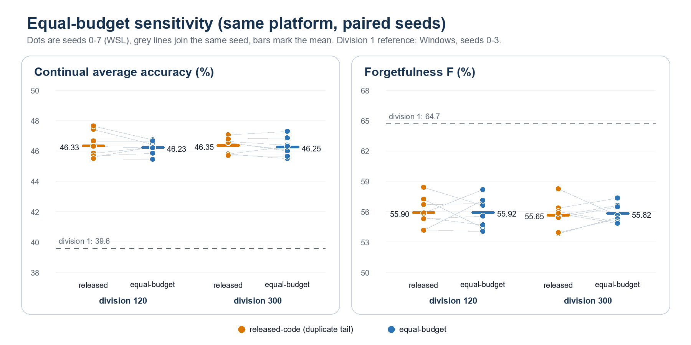

# Reproducing Interleave-Division Replay on ciFAIR-100

**A four-seed audit of Table 1 in Tee and Zhang (2023)**

Independent reproduction note prepared for research discussion

August 2026; equal-budget control added September 2026

## Executive summary

This study reproduces the ciFAIR-100 interleave-division experiment from Ren
Jie Tee and Mengmi Zhang, *Integrating Curricula with Replays: Its Effects on
Continual Learning*. The bounded matrix covers divisions `1 / 120 / 300` with
controlled seeds `0 / 1 / 2 / 3`, using the ordering behavior in the authors'
released code.

All 12 planned runs completed. The six headline metrics are within 0.79
percentage points of the paper, and the reported qualitative ordering is
recovered:

1. division 120 improves continual average accuracy and reduces forgetfulness
   relative to division 1;
2. division 300 provides no accuracy gain over division 120; and
3. the numerical deviations are small and consistent across the three tested
   conditions.

| Division | Reproduction Avg Acc, mean +/- sample std | Paper Avg Acc | Delta | Reproduction F, mean +/- sample std | Paper F | Delta |
|---:|---:|---:|---:|---:|---:|---:|
| 1 | 39.59% +/- 0.42% | 39.9% | -0.31 pp | 64.69% +/- 0.52% | 63.9% | +0.79 pp |
| 120 | **46.49% +/- 0.75%** | 46.6% | -0.11 pp | **55.50% +/- 0.67%** | 55.1% | +0.40 pp |
| 300 | 46.38% +/- 0.55% | 46.6% | -0.22 pp | 56.70% +/- 1.07% | 56.1% | +0.60 pp |

For accuracy, higher is better. For `F`, lower is better. Delta is reproduction
minus paper, measured in percentage points.

A follow-up equal-budget control (32 WSL runs, paired seeds `0-7`) removes the
released code's duplicate current-task tail. The paired accuracy change is
-0.10 pp at both division 120 and 300 (95% CIs within +/-0.6 pp), while both
divisions still exceed division 1 by about 6.6 pp. The interleaving gain is
therefore not an artifact of unequal sample counts.

## Experimental protocol

| Component | Locked configuration |
|---|---|
| Dataset and stream | ciFAIR-100; 20 tasks; 5 new classes per task; class-order seed 100 |
| Model | ImageNet-pretrained torchvision MobileNetV3-Small; expanding five-class head |
| Replay | 1,200 images, rebalanced equally across all seen classes |
| Optimization | SGD; LR 0.001; momentum 0.9; batch size 32; patience 5 |
| Comparison | Released-code divisions `1 / 120 / 300`; seeds `0 / 1 / 2 / 3` |
| Execution | Deterministic CUDA; AMP; image size 74 |
| Environment | Python 3.10.20; PyTorch 2.13.0+cu126; torchvision 0.28.0+cu126; RTX 4080 Laptop GPU |

Let `a_t` be accuracy on all classes seen after task `t`, and let `b_t` be
accuracy on the five Task-1 classes after task `t`.

```text
continual average accuracy = mean_{t=1..20}(a_t)
forgetfulness F           = mean_{t=2..20}((b_1 - b_t) / b_1)
```

The Task-1 row is excluded from `F`, following the authors' released plotting
notebook.

## Interpretation

Moving from division 1 to division 120 raises continual average accuracy by
6.90 points and lowers `F` by 9.19 points. Moving further to division 300 does
not increase average accuracy and increases `F` by 1.21 points relative to
division 120. The main result is therefore a benefit from substantial
interleaving, followed by a plateau rather than monotonic improvement.

All reproduction accuracy means are slightly lower than the paper, while all
reproduction `F` means are slightly higher. The largest gap is 0.79 points.
This small consistent shift is compatible with differences in current CUDA
kernels, torchvision pretrained weights, and the original software
environment; it does not change the experimental ordering.

## Audit findings and limitations

### Released-code sample-budget confound

The released implementation duplicates the tail of the current-task sequence
when it constructs chunks. With 2,250 current examples, this exposes 90 extra
current examples per epoch at division 120 and 150 extra at division 300.
The main matrix intentionally preserves that behavior to trace the published
code and Table 1 trend; the equal-budget control below shows that the
duplicate tail does not explain the gain.

### Paper-code image-size discrepancy

The paper appendix states 72x72, while the released `VaryDiv.py` uses 74x74.
This reproduction follows the released code and records image size 74 in every
result.

### Bounded division set

The experiment tests three of the five reported divisions. Divisions 8 and 60
remain untested. The selected conditions test the main qualitative claims but
do not reconstruct the full curve.

### Runtime caveat

Two early division-1 runs contain Windows Modern Standby intervals. Their
metrics and saved matrices are complete, but their elapsed-time values are not
valid for speed comparison.

## Equal-budget control

The `equal-budget` implementation presents every current and replay example
exactly once per epoch while keeping the interleave schedule. Division 1 has
an identical sequence under both implementations, so only divisions 120 and
300 were rerun.

**Platform control.** Windows and WSL runs with identical library versions are
not bit-identical: the CPU bicubic resize rounds differently, and the
division-120 seed-0 run moves by 1.64 pp in accuracy. Both arms were therefore
rerun under WSL with paired seeds `0-7` (32 runs). All 32 accuracy matrices are
20x20 with no NaN or Infinity.

| Division | released-code Avg Acc | equal-budget Avg Acc | Paired diff (95% CI) | released-code F | equal-budget F | Paired diff (95% CI) |
|---:|---:|---:|---:|---:|---:|---:|
| 120 | 46.33% +/- 0.84% | 46.23% +/- 0.42% | -0.10 pp [-0.59, +0.39] | 55.90% +/- 1.48% | 55.92% +/- 1.47% | +0.01 pp [-1.59, +1.62] |
| 300 | 46.35% +/- 0.52% | 46.25% +/- 0.60% | -0.10 pp [-0.40, +0.20] | 55.65% +/- 1.40% | 55.82% +/- 0.88% | +0.17 pp [-1.10, +1.44] |

Intervals use the paired Student-t distribution; exact sign-flip tests give
p = 0.66 (division 120) and 0.45 (division 300) for accuracy.



1. The duplicate tail has no detectable effect; the accuracy effect is bounded
   to roughly +/-0.5 pp.
2. Under equal budgets, divisions 120 and 300 exceed division 1 by 6.64 and
   6.66 pp in accuracy and lower `F` by 8.77 and 8.87 pp. The division-1
   reference is the Windows four-seed mean; cross-platform noise (about 1.6 pp)
   is far smaller than this gap.
3. Division 300 again adds nothing over division 120, matching the plateau.
4. With four seeds, division 300 briefly showed a -0.39 pp difference (4/4
   negative) that vanished at eight seeds. Single-run differences below about
   1 pp should not be interpreted under this protocol.

## Evidence integrity

- 12/12 planned main-matrix cells and 32/32 equal-budget control cells completed.
- Every run stores a 20x20 accuracy matrix.
- No NaN or Infinity occurs in the JSON or CSV evidence.
- The final controller exited with code 0 and empty error logs.
- Every result records configuration, environment, task trajectory, epoch log,
  matrix, and checkpoint.
- Fifteen repository tests cover class order, sequencing, replay quotas,
  paper metric definitions, and the paired equal-budget statistics.

## Reproduction command

Main matrix (Windows):

```powershell
$env:TORCH_HOME = "$PWD\.torch-cache"
conda run --no-capture-output -n ece488_clip python run_tee_zhang_2023_matrix.py `
  --sequence-implementation released-code `
  --divisions 1 120 300 `
  --seeds 0 1 2 3
```

Equal-budget control (WSL, conda env `cifar-cl`):

```bash
python run_tee_zhang_2023_matrix.py --sequence-implementation equal-budget \
  --divisions 120 300 --seeds 0 1 2 3 4 5 6 7
python run_tee_zhang_2023_matrix.py --output-root runs/tee-zhang-2023/wsl-platform-check \
  --sequence-implementation released-code --divisions 120 300 --seeds 0 1 2 3 4 5 6 7
python tools/analyze_tee_zhang_equal_budget.py --seeds 0 1 2 3 4 5 6 7
```

The runner validates matching configurations, skips completed cells, and
updates `summary.json` and `summary.csv` after every successful run.

## Reference

R. J. Tee and M. Zhang. *Integrating Curricula with Replays: Its Effects on
Continual Learning.* AAAI Summer Symposium Series, 2023.

- Paper: <https://ojs.aaai.org/index.php/AAAI-SS/article/view/27486>
- Code: <https://github.com/ZhangLab-DeepNeuroCogLab/Integrating-Curricula-with-Replays>
